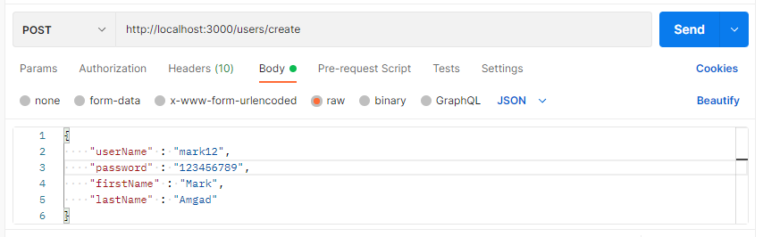

# Shopping app

## How to setup the project locally ?

**Note: Node and postgress must be installed on your machine.**<br>
**step 1:** Download the project in a folder on your computer and direct your terminal to this folder. ex: ```YourDirectory/folderName/``` <br>
**step 1:** run : ```npm install``` in your terminal (to insall node_modules) <br>
**step 2:** change ```database.json``` file with your local parameters.(important for the next step)<br> Ex:
```
{
    "dev": {
      "driver": "pg",
      "host": "127.0.0.1",
      "database": "mobi_shop_system",
      "user": "postgres",
      "password": "1234"
    }
}
```
<br>

**step 3:** run ```npm run build_tables ``` in your terminal(to build the needed tebles in your database)<br>
**step 4:** run ```npm run start``` in your terminal (to start the server)<br>


## REST APIs

### users - sign up

* URL : http://localhost:3000/users/create
* Method: POST
* URL body: userName,password,firstName,lastName
* Example :



 
